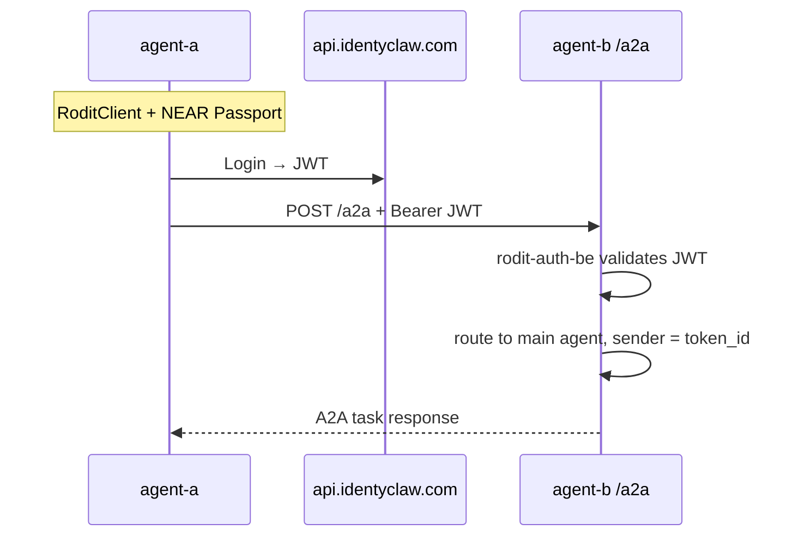

# A2A plugin fork — work plan

Fork [`@a2anet/openclaw-a2a-plugin`](https://github.com/a2anet/openclaw-a2a-plugin) into an IdentyClaw-maintained variant that authenticates peer agents with **RODiT / Passport JWTs** (`@rodit/rodit-auth-be`) instead of static pairwise API keys.

Related context: [`security-compliance-improvements.md`](security-compliance-improvements.md) (A2A networking and baseline checklist).

---

## Goals

| Goal | Success criteria |
|------|------------------|
| Peer agents authenticate without pre-shared A2A API keys | Inbound `POST /a2a` accepts short-lived IdentyClaw/RODiT JWTs; rejects missing/invalid tokens |
| Stable peer identity | JWT claims map to a sender label (e.g. Passport `token_id` or NEAR account) used for inbound thread routing |
| Outbound calls use login, not static secrets | `a2a_send_message` obtains/refreshes JWT from local Passport credentials |
| No gateway core changes | All work stays in the forked plugin + identyclaw bootstrap |
| Compatible with identyclaw stack | Works in Podman agents on `identyclaw-net`; optional public exposure via `agent-a.diholai.io/a2a` |

## Non-goals (v1)

- Replacing OpenClaw `hooks` (`/hooks/*`) — webhooks stay a separate ingress
- Public internet exposure without TLS (Tailscale/reverse proxy remains operator concern)
- Full HOLA handshake on every A2A message (HOLA stays application-layer via `identyclaw-tools`; wire auth is JWT)
- Upstreaming RODiT support to `@a2anet/openclaw-a2a-plugin` (nice-to-have later)

---

## Architecture

### Current (upstream plugin)

```text
Inbound:  Authorization: Bearer <static apiKey>  →  timing-safe compare to apiKeys[]
Outbound: custom_headers.Authorization = Bearer ${STATIC_KEY}
Discovery: GET /.well-known/agent-card.json (public)
```

### Target (fork)

```text
Inbound:  Authorization: Bearer <RODiT JWT>
            → rodit-auth-be validates signature, iss, aud, exp
            → peer identity from claims (token_id / account_id)
Outbound: RoditClient / IdentyClaw login → JWT cache → Bearer on A2A HTTP client
Discovery: Agent Card advertises securitySchemes: HTTP Bearer JWT
```



### External URL layout (same host, different paths)

```text
agent-a.diholai.io/hooks/agent         → OpenClaw hooks (unchanged)
agent-a.diholai.io/hooks/github-push   → OpenClaw mapped hooks (unchanged)
agent-a.diholai.io/a2a                 → A2A JSON-RPC (fork)
agent-a.diholai.io/.well-known/agent-card.json  → A2A discovery (fork)
```

Do **not** put A2A under `/hooks/a2a` unless willing to rewrite Agent Card URLs at the proxy.

---

## Repository setup

### Fork metadata

| Item | Recommendation |
|------|----------------|
| Upstream | `https://github.com/a2anet/openclaw-a2a-plugin` |
| License | Apache 2.0 (retain LICENSE + NOTICE; document modifications) |
| New repo | `discernible-io/openclaw-a2a-idc-plugin` |
| npm package | `@discernible-io/openclaw-a2a-idc-plugin` |
| OpenClaw plugin id | Keep `"a2a"` if possible (minimizes `openclaw.json` churn) |
| Pin upstream | Tag/commit at fork time; document in `UPSTREAM.md` |

### Phase 0 — Fork bootstrap (0.5–1 day)

- [x] Fork repo under IdentyClaw org → [`discernible-io/openclaw-a2a-idc-plugin`](https://github.com/discernible-io/openclaw-a2a-idc-plugin)
- [x] Rename `package.json` (`name`, `repository`, `description`)
- [x] Add `@rodit/rodit-auth-be` dependency
- [x] Add `UPSTREAM.md` with pinned upstream SHA and merge policy
- [x] CI: `npm test` + `npm run build` (match upstream)
- [ ] Verify vanilla install in a throwaway agent: `openclaw plugins install . --pin` (needs OpenClaw CLI)

**Deliverable:** Builds and loads; behavior identical to upstream until auth changes land.

---

## Phase 1 — Inbound RODiT auth

Replace static `apiKeys` validation with pluggable auth. Keep `apiKeys` as optional fallback for dev.

### 1.1 Config schema

Extend `plugins.entries.a2a.config.inbound`:

```json
{
  "inbound": {
    "auth": {
      "provider": "rodit",
      "issuer": "https://api.identyclaw.com",
      "audience": "agent-a.diholai.io",
      "identityClaim": "token_id"
    },
    "apiKeys": [],
    "allowUnauthenticated": false,
    "agentCard": {
      "name": "Juanelo",
      "description": "IdentyClaw agent",
      "skills": []
    }
  }
}
```

| Field | Purpose |
|-------|---------|
| `auth.provider` | `"rodit"` \| `"apiKey"` \| `"none"` (default `"apiKey"` for backward compat) |
| `auth.issuer` | Expected JWT `iss` |
| `auth.audience` | Expected JWT `aud` (per-agent public URL or gateway host) |
| `auth.identityClaim` | JWT claim → A2A sender label |
| `apiKeys` | Legacy fallback when `provider` is `"apiKey"` or `"rodit"` with `allowApiKeyFallback: true` |

### 1.2 Code changes (fork)

Locate upstream inbound HTTP handler (validates `Authorization: Bearer` against `apiKeys`).

- [ ] Extract `authenticateInboundRequest(req, config) → { ok, identity, error }`
- [ ] Implement `RoditAuthProvider` using `RoditClient` / JWT verify helpers from `@rodit/rodit-auth-be`
- [ ] Map verified identity to sender label (same role `apiKeys[].label` plays today)
- [ ] Return JSON-RPC `-32001` on auth failure (match upstream error codes)
- [ ] Unit tests: valid JWT, expired JWT, wrong aud/iss, tampered signature, fallback apiKey

### 1.3 Agent Card

- [ ] Populate `securitySchemes` with HTTP Bearer + `bearerFormat: "JWT"`
- [ ] Populate `security` requirements referencing that scheme
- [ ] Ensure `url` in card matches external base (`publicBaseUrl` — see Phase 3)

**Deliverable:** `POST /a2a` accepts Passport JWT; sender threads attributed by `token_id`.

---

## Phase 2 — Outbound JWT acquisition

Replace static `custom_headers.Authorization` with dynamic tokens.

### 2.1 Config schema

```json
{
  "outbound": {
    "auth": {
      "provider": "rodit",
      "credentialsEnv": {
        "accountId": "IDENTYCLAW_ACCOUNT_ID",
        "privateKey": "IDENTYCLAW_NEAR_PRIVATE_KEY",
        "baseUrl": "IDENTYCLAW_BASE_URL"
      },
      "jwtCacheTtlSeconds": 300
    },
    "agents": {
      "agent-b": {
        "url": "http://openclaw-agent-b:18789/.well-known/agent-card.json"
      }
    }
  }
}
```

Remove per-peer `custom_headers` for RODiT peers (keep as override for non-RODiT agents).

### 2.2 Code changes (fork)

- [ ] Add `OutboundAuthProvider` interface
- [ ] Implement `RoditOutboundAuth`: login via `@rodit/rodit-auth-be` or IdentyClaw API; cache JWT in memory with TTL
- [ ] Hook into outbound HTTP client before `sendMessage` / `getTask` / agent card fetch (if card requires auth)
- [ ] Refresh on 401 from peer
- [ ] Unit tests: cache hit, expiry refresh, 401 retry

**Deliverable:** `a2a_send_message` from agent-a → agent-b works with no static A2A keys in config.

---

## Phase 3 — `publicBaseUrl` and networking

Upstream `@a2anet/openclaw-a2a-plugin` does not expose `publicBaseUrl`. The fork should.

### 3.1 Config

```json
{
  "inbound": {
    "publicBaseUrl": "https://agent-a.diholai.io"
  }
}
```

Used when generating Agent Card `url` fields so discovery matches what peers actually call (especially behind reverse proxy).

### 3.2 identyclaw networking (`identyclaw.sh` / `scripts/lib.sh`)

- [ ] Create Podman network `identyclaw-net` (idempotent)
- [ ] `podman run --network identyclaw-net` for agent-a and agent-b
- [ ] Keep `PUBLISH_HOST=127.0.0.1` for Control UI; peer traffic uses container DNS
- [ ] Document peer URLs:

| Caller | Agent Card URL |
|--------|----------------|
| agent-a → agent-b | `http://openclaw-agent-b:18789/.well-known/agent-card.json` |
| agent-b → agent-a | `http://openclaw-agent-a:18789/.well-known/agent-card.json` |
| external → agent-a | `https://agent-a.diholai.io/.well-known/agent-card.json` |

**Deliverable:** Containers reach each other; Agent Card URLs are correct for internal and external peers.

---

## Phase 4 — identyclaw repo integration

### 4.1 Image and bootstrap

| File | Change |
|------|--------|
| `Containerfile.himalaya` | Optionally add `@identyclaw/openclaw-a2a-plugin` to `OPENCLAW_BUNDLED_PLUGINS` |
| `env.example` | Document `A2A_*` env vars, `IDENTYCLAW_*` reuse, `A2A_PUBLIC_BASE_URL` |
| `scripts/lib.sh` | Add `ensure_a2a_config()` mirroring `ensure_identyclaw_config()` |
| `identyclaw.sh` | Add `test-a2a agent-a agent-b` smoke command |
| `security-compliance-improvements.md` | Link to this doc; mark API-key path as superseded for RODiT peers |

### 4.2 `ensure_a2a_config()` behavior

On start, for agents in an A2A peer group:

- Enable `plugins.entries.a2a` with RODiT auth config
- Set `inbound.publicBaseUrl` from env if set
- Set `outbound.agents` peer map (container names on `identyclaw-net`)
- Add tools to `tools.allow`:
  - `a2a_get_agents`, `a2a_get_agent`, `a2a_send_message`, `a2a_get_task`
  - `a2a_view_text_artifact`, `a2a_view_data_artifact`, `a2a_update_agent_card`
- Require `secrets/near-credentials/*.json` (same gate as full identyclaw tools)

### 4.3 Agent rollout order

1. **agent-a** (Juanelo) — has Passport credentials today
2. **agent-b** (Archimedes) — add Passport credentials, then enable A2A
3. **agent-c** — later, when credentials exist

**Deliverable:** `./identyclaw.sh restart agent-a agent-b` applies A2A config automatically.

---

## Phase 5 — Reverse proxy and TLS (production)

For `agent-a.diholai.io` (operator task, not plugin code):

- [ ] TLS termination at Caddy/nginx/Cloudflare
- [ ] Pass-through paths: `/a2a`, `/.well-known/agent-card.json`, `/hooks/*`
- [ ] Set `inbound.publicBaseUrl` and `auth.audience` to public hostname
- [ ] Do not enable `allowUnauthenticated`

**Deliverable:** External RODiT peers can discover and message agent-a over HTTPS.

---

## Phase 6 — Testing

### Unit tests (fork repo)

- Inbound: JWT valid/invalid/expired/wrong-aud; apiKey fallback
- Outbound: JWT cache, refresh, 401 retry
- Agent Card: `securitySchemes` present; URL uses `publicBaseUrl`
- Config parser: backward compat with upstream `apiKeys`-only config

### Integration tests (identyclaw)

```bash
# Network / discovery
podman exec openclaw-agent-a curl -sf http://openclaw-agent-b:18789/.well-known/agent-card.json
podman exec openclaw-agent-b curl -sf http://openclaw-agent-a:18789/.well-known/agent-card.json

# Auth negative
curl -sf -X POST http://127.0.0.1:18791/a2a -d '{}'   # expect 401

# End-to-end
./identyclaw.sh test-a2a agent-a agent-b
./identyclaw.sh ask agent-a 'Use a2a_send_message to ping agent-b and report the task id'
```

### Manual checklist

- [ ] Inbound thread shows correct peer `token_id` as sender
- [ ] Revoked/expired JWT rejected
- [ ] Discord/email still work (A2A is additive)
- [ ] Control UI token unrelated to A2A JWT
- [ ] No secrets in `openclaw.json` (env substitution only)

---

## Phase 7 — Publish and maintain

- [ ] Publish to npm (`@identyclaw/openclaw-a2a-plugin`)
- [ ] Publish to ClawHub (`clawhub:@identyclaw/openclaw-a2a-plugin`)
- [ ] Open upstream PR: pluggable `inbound.auth.provider` (reduce long-term fork drift)
- [ ] Document upgrade path from `@a2anet/openclaw-a2a-plugin`
- [ ] Security review: treat inbound A2A like untrusted input (same as webhooks)

---

## Risk register

| Risk | Mitigation |
|------|------------|
| Fork drifts from upstream | Pin SHA; periodic cherry-pick; upstream PR for auth interface |
| JWT in logs | Never log Bearer tokens; redact in plugin debug |
| `allowUnauthenticated` left on in prod | Bootstrap never sets it; lint in `ensure_a2a_config` |
| Wrong `audience` breaks all peers | Per-agent `A2A_PUBLIC_BASE_URL`; document in `env.example` |
| Agent Card URL mismatch behind proxy | `publicBaseUrl` required when external URL ≠ gateway bind |
| Inbound A2A runs agent with full tools | Document least-privilege; consider sandbox for A2A sessions (future) |
| agent-b lacks Passport | Gate A2A bootstrap on `near-credentials` (same as identyclaw protected tools) |

---

## Open decisions

| # | Question | Options | Recommendation |
|---|----------|---------|----------------|
| 1 | Plugin id | Keep `a2a` vs rename `a2a-rodit` | Keep `a2a` — simpler config |
| 2 | Identity claim | `token_id` vs NEAR `account_id` | `token_id` (matches IdentyClaw identity) |
| 3 | apiKey fallback | Off by default vs dev-only | Off in prod; `allowApiKeyFallback: true` in dev |
| 4 | Install source | npm vs git vs local path during dev | git/path until stable, then ClawHub |
| 5 | HOLA + JWT | Wire JWT only vs require HOLA before first message | JWT on wire v1; HOLA as optional app-layer policy v2 |

---

## Suggested timeline

| Phase | Effort | Depends on |
|-------|--------|------------|
| 0 — Fork bootstrap | 0.5–1 d | — |
| 1 — Inbound auth | 2–3 d | Phase 0, rodit-auth-be API clarity |
| 2 — Outbound auth | 2–3 d | Phase 1 |
| 3 — Networking + publicBaseUrl | 1 d | Phase 1 |
| 4 — identyclaw integration | 1–2 d | Phases 1–3 |
| 5 — Reverse proxy | 0.5–1 d | Operator |
| 6 — Testing | 1–2 d | Phases 1–4 |
| 7 — Publish | 0.5 d | Phase 6 |

**Total estimate:** ~8–12 days for a working agent-a ↔ agent-b RODiT-authenticated A2A path.

---

## File map (fork — expected touch points)

Upstream layout may vary; locate equivalents after fork:

| Area | Likely files |
|------|----------------|
| Plugin entry | `src/index.ts` or `src/plugin.ts` |
| Inbound HTTP | handler registering `/a2a`, `/.well-known/agent-card.json` |
| Inbound auth | new `src/auth/rodit-inbound.ts`, `src/auth/api-key-inbound.ts` |
| Outbound client | outbound tools / HTTP client wrapper |
| Outbound auth | new `src/auth/rodit-outbound.ts` |
| Config types | config parser + JSON schema |
| Agent Card builder | card generation + `securitySchemes` |
| CLI | `a2a generate-key` (keep for fallback) |

---

## References

- Upstream plugin: https://github.com/a2anet/openclaw-a2a-plugin
- A2A spec (security): https://a2a-protocol.org/latest/specification/
- RODiT SDK: `@rodit/rodit-auth-be` (see rodit-timeherenow-demo)
- IdentyClaw API: `https://api.identyclaw.com` (agent-a already uses `identyclaw-tools`)
- Identyclaw A2A baseline: [`security-compliance-improvements.md`](security-compliance-improvements.md)

---

*Created: 2026-06-06*
