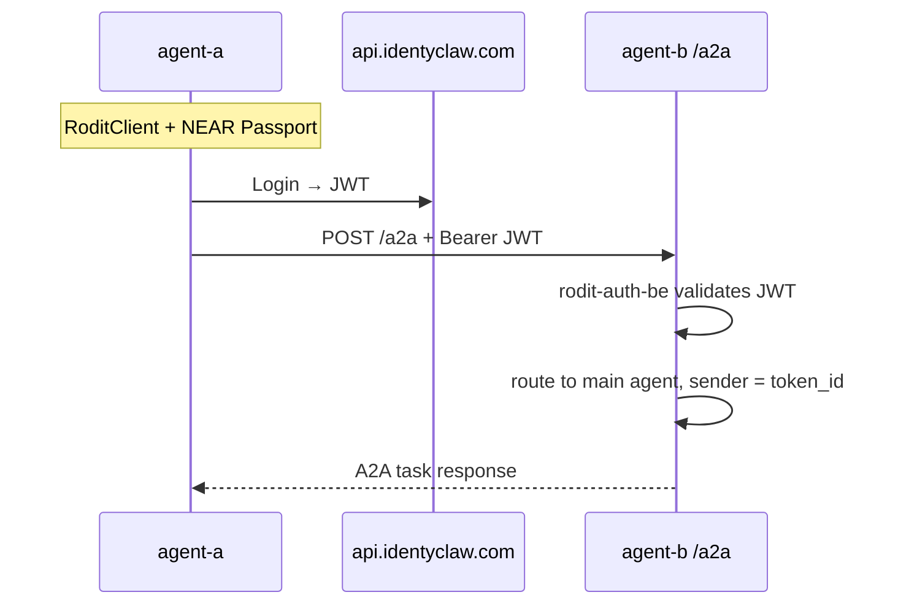

# A2A plugin fork — work plan

Fork [`@a2anet/openclaw-a2a-plugin`](https://github.com/a2anet/openclaw-a2a-plugin) into an IdentyClaw-maintained variant that authenticates peer agents with **RODiT / Passport JWTs** (`@rodit/rodit-auth-be`) instead of static pairwise API keys.

Related context: [`security-compliance-improvements.md`](security-compliance-improvements.md) (A2A networking and baseline checklist).

---

## Current status

| Phase | Status | Notes |
|-------|--------|-------|
| 0 — Fork bootstrap | Done | Pushed to [`discernible-io/openclaw-a2a-idc-plugin`](https://github.com/discernible-io/openclaw-a2a-idc-plugin) |
| 1 — Inbound RODiT auth | Done | Committed with Phase 2 |
| 2 — Outbound JWT acquisition | Done | Tier 1 unit tests pass; staging smoke deferred to identyclaw |
| **3 — publicBaseUrl** | **Done (plugin)** | Config + URL resolution implemented |
| **4 — identyclaw integration** | **Done** | `ensure_a2a_config`, `identyclaw-net`, `test-a2a` in identyclaw-openclaw |
| 5+ | Not started | Reverse proxy / staging smoke |

**Active step:** Phase 5 — reverse proxy and TLS (operator); Tier 2–3 staging smoke on identyclaw host.

**Exit criteria for Phase 2:**

1. `outbound.auth.provider: "rodit"` reads NEAR credentials from env (`IDENTYCLAW_*` by default).
2. Plugin calls `@rodit/rodit-auth-be` `login_server` against IdentyClaw API → caches JWT.
3. Outbound A2A HTTP calls attach `Authorization: Bearer <jwt>`; retry once on 401 after cache invalidation.
4. **CI gate:** unit tests pass with injected mocks at RODiT boundaries (cache hit, invalidate/refresh, 401 retry) — no live blockchain or IdentyClaw API required (see [Test strategy](#test-strategy)).
5. **Staging gate (not local/CI default):** manual smoke in identyclaw — agent-a messages agent-b over `identyclaw-net` with inbound RODiT on both sides and real Passport credentials.

---

## Goals

| Goal | Success criteria |
|------|------------------|
| Peer agents authenticate without pre-shared A2A API keys | Inbound `POST /a2a` accepts short-lived IdentyClaw/RODiT JWTs; rejects missing/invalid tokens |
| Stable peer identity | JWT claims map to a sender label (e.g. Passport `token_id` or NEAR account) used for inbound thread routing |
| Outbound calls use login, not static secrets | `a2a_send_message` obtains/refreshes JWT from local Passport credentials |
| No gateway core changes | All work stays in the forked plugin + identyclaw bootstrap |
| Compatible with identyclaw stack | Works in Podman agents on `identyclaw-net`; optional public exposure via `agent-a.diholai.io/a2a` |

## Non-goals (v1)

- Replacing OpenClaw `hooks` (`/hooks/*`) — webhooks stay a separate ingress
- Public internet exposure without TLS (Tailscale/reverse proxy remains operator concern)
- Full HOLA handshake on every A2A message (HOLA stays application-layer via `identyclaw-tools`; wire auth is JWT)
- Upstreaming RODiT support to `@a2anet/openclaw-a2a-plugin` (nice-to-have later)

---

## Architecture

### Current (upstream plugin)

```text
Inbound:  Authorization: Bearer <static apiKey>  →  timing-safe compare to apiKeys[]
Outbound: custom_headers.Authorization = Bearer ${STATIC_KEY}
Discovery: GET /.well-known/agent-card.json (public)
```

### Target (fork)

```text
Inbound:  Authorization: Bearer <RODiT JWT>
            → rodit-auth-be validates signature, iss, aud, exp
            → peer identity from claims (token_id / account_id)
Outbound: RoditClient / IdentyClaw login → JWT cache → Bearer on A2A HTTP client
Discovery: Agent Card advertises securitySchemes: HTTP Bearer JWT
```



### External URL layout (same host, different paths)

```text
agent-a.diholai.io/hooks/agent         → OpenClaw hooks (unchanged)
agent-a.diholai.io/hooks/github-push   → OpenClaw mapped hooks (unchanged)
agent-a.diholai.io/a2a                 → A2A JSON-RPC (fork)
agent-a.diholai.io/.well-known/agent-card.json  → A2A discovery (fork)
```

Do **not** put A2A under `/hooks/a2a` unless willing to rewrite Agent Card URLs at the proxy.

---

## Reference implementations

Use these repos to understand **authentication and authorization patterns**. Do **not** vendor or deep-link them into this plugin — call the published npm package [`@rodit/rodit-auth-be`](https://www.npmjs.com/package/@rodit/rodit-auth-be) only.

| Repo | Role | What to copy from it |
|------|------|----------------------|
| [`discernible-io/idclawserver-idc`](https://github.com/discernible-io/idclawserver-idc) | **Server** (IdentyClaw / Passport API) | JWT issuance, `POST /api/login` contract, inbound JWT validation (`validate_jwt_token_be`), expected `iss` / `aud`, session semantics |
| [`discernible-io/clienttest-idc`](https://github.com/discernible-io/clienttest-idc) | **Client** (outbound caller) | Account-based login flow, env/credential layout, how callers attach `Authorization: Bearer` after `login_server` |

Both repos are private to the Discernible org — clone locally when implementing or debugging. When their behavior and `rodit-auth-be` README diverge, treat **`@rodit/rodit-auth-be` as the integration surface** for this fork.

### Mapping reference → this fork

| Concern | Reference (server / client) | This plugin (`@rodit/rodit-auth-be` only) |
|---------|----------------------------|---------------------------------------------|
| **Inbound** — validate peer JWT on `POST /a2a` | Server middleware / token service | `validate_jwt_token_be` via `src/auth/rodit-inbound.ts`; `enforceSessionRegistration: false` for peer tokens |
| **Inbound** — sender identity | JWT claims (`token_id`, etc.) | `inbound.auth.identityClaim` → A2A sender label |
| **Outbound** — obtain JWT | Client `login_server` / env credentials | `RoditOutboundAuthProvider` in `src/auth/rodit-outbound.ts` → `login_server` against `IDENTYCLAW_BASE_URL` |
| **Outbound** — attach Bearer | Client HTTP wrapper | `AuthenticatedA2AAgents` + `withOutboundAuthRetry` in `src/outbound/` |
| **Outbound** — refresh on 401 | Client retry policy | `invalidate()` + single retry in `src/outbound/retry.ts` |

### npm dependency rule

```text
✅  @rodit/rodit-auth-be  (login_server, validate_jwt_token_be, exported helpers)
❌  git/path dependency on idclawserver-idc or clienttest-idc
❌  copying server/client source into src/
```

---

## Repository setup

### Fork metadata

| Item | Recommendation |
|------|----------------|
| Upstream | `https://github.com/a2anet/openclaw-a2a-plugin` |
| License | Apache 2.0 (retain LICENSE + NOTICE; document modifications) |
| New repo | `discernible-io/openclaw-a2a-idc-plugin` |
| npm package | `@discernible-io/openclaw-a2a-idc-plugin` |
| OpenClaw plugin id | Keep `"a2a"` if possible (minimizes `openclaw.json` churn) |
| Pin upstream | Tag/commit at fork time; document in `UPSTREAM.md` |

### Phase 0 — Fork bootstrap (0.5–1 day)

- [x] Fork repo under IdentyClaw org → [`discernible-io/openclaw-a2a-idc-plugin`](https://github.com/discernible-io/openclaw-a2a-idc-plugin)
- [x] Rename `package.json` (`name`, `repository`, `description`)
- [x] Add `@rodit/rodit-auth-be` dependency
- [x] Add `UPSTREAM.md` with pinned upstream SHA and merge policy
- [x] CI: `npm test` + `npm run build` (match upstream)
- [ ] Verify vanilla install in a throwaway agent: `openclaw plugins install . --pin` (needs OpenClaw CLI)

**Deliverable:** Builds and loads; behavior identical to upstream until auth changes land.

---

## Phase 1 — Inbound RODiT auth

Replace static `apiKeys` validation with pluggable auth. Keep `apiKeys` as optional fallback for dev.

### 1.1 Config schema

Extend `plugins.entries.a2a.config.inbound`:

```json
{
  "inbound": {
    "auth": {
      "provider": "rodit",
      "issuer": "https://api.identyclaw.com",
      "audience": "agent-a.diholai.io",
      "identityClaim": "token_id"
    },
    "apiKeys": [],
    "allowUnauthenticated": false,
    "agentCard": {
      "name": "Juanelo",
      "description": "IdentyClaw agent",
      "skills": []
    }
  }
}
```

| Field | Purpose |
|-------|---------|
| `auth.provider` | `"rodit"` \| `"apiKey"` \| `"none"` (default `"apiKey"` for backward compat) |
| `auth.issuer` | Expected JWT `iss` |
| `auth.audience` | Expected JWT `aud` (per-agent public URL or gateway host) |
| `auth.identityClaim` | JWT claim → A2A sender label |
| `apiKeys` | Legacy fallback when `provider` is `"apiKey"` or `"rodit"` with `allowApiKeyFallback: true` |

### 1.2 Code changes (fork)

Locate upstream inbound HTTP handler (validates `Authorization: Bearer` against `apiKeys`).

- [x] Extract `authenticateInboundRequest(req, config) → { ok, identity, error }`
- [x] Implement `RoditAuthProvider` using `RoditClient` / JWT verify helpers from `@rodit/rodit-auth-be`
- [x] Map verified identity to sender label (same role `apiKeys[].label` plays today)
- [x] Return JSON-RPC `-32001` on auth failure (match upstream error codes)
- [x] Unit tests: valid JWT, expired JWT, wrong aud/iss, tampered signature, fallback apiKey

### 1.3 Agent Card

- [x] Populate `securitySchemes` with HTTP Bearer + `bearerFormat: "JWT"`
- [x] Populate `security` requirements referencing that scheme
- [x] Ensure `url` in card matches external base (`publicBaseUrl` — see Phase 3)

**Deliverable:** `POST /a2a` accepts Passport JWT; sender threads attributed by `token_id`.

> Phase 1 code ships with Phase 2 commit (`ce0a385`).

---

## Phase 2 — Outbound JWT acquisition *(done)*

Replace static `custom_headers.Authorization` with dynamic tokens.

**Reference:** outbound login and Bearer attachment patterns in [`clienttest-idc`](https://github.com/discernible-io/clienttest-idc); API contract in [`idclawserver-idc`](https://github.com/discernible-io/idclawserver-idc). Implementation uses **`login_server` from `@rodit/rodit-auth-be`** only.

### 2.1 Config schema

```json
{
  "outbound": {
    "auth": {
      "provider": "rodit",
      "credentialsEnv": {
        "accountId": "IDENTYCLAW_ACCOUNT_ID",
        "privateKey": "IDENTYCLAW_NEAR_PRIVATE_KEY",
        "baseUrl": "IDENTYCLAW_BASE_URL"
      },
      "jwtCacheTtlSeconds": 300
    },
    "agents": {
      "agent-b": {
        "url": "http://openclaw-agent-b:18789/.well-known/agent-card.json"
      }
    }
  }
}
```

| Field | Purpose |
|-------|---------|
| `auth.provider` | `"rodit"` enables dynamic JWT (omit for legacy static headers only) |
| `credentialsEnv.accountId` | Env var name holding NEAR account id (default `IDENTYCLAW_ACCOUNT_ID`) |
| `credentialsEnv.privateKey` | Env var name holding base58/ed25519 private key (default `IDENTYCLAW_NEAR_PRIVATE_KEY`) |
| `credentialsEnv.baseUrl` | Env var name for IdentyClaw API base URL used by `login_server` (default `IDENTYCLAW_BASE_URL`) |
| `jwtCacheTtlSeconds` | In-memory JWT cache TTL before re-login (default 300) |

Remove per-peer `custom_headers.Authorization` for RODiT peers (keep other `custom_headers` and non-RODiT static auth as overrides).

### 2.2 Code changes (fork)

| File | Purpose |
|------|---------|
| `src/auth/outbound-auth.ts` | `OutboundAuthProvider` interface |
| `src/auth/rodit-outbound.ts` | `RoditOutboundAuthProvider` — env credentials, `login_server`, JWT cache |
| `src/outbound/authenticated-agents.ts` | Injects dynamic `Authorization` into `@a2anet/a2a-utils` agent fetches |
| `src/outbound/retry.ts` | 401 detection, cache invalidation, single retry |
| `src/outbound/tools.ts` | Wires auth provider into outbound tool execution |

Checklist:

- [x] Add `OutboundAuthProvider` interface
- [x] Implement `RoditOutboundAuthProvider`: `login_server` via `@rodit/rodit-auth-be`; cache JWT in memory with TTL
- [x] Hook into outbound HTTP client before `sendMessage` / `getTask` (via `AuthenticatedA2AAgents`)
- [x] Refresh on 401 from peer (`withOutboundAuthRetry`)
- [x] Unit tests green with injected `RoditLoginFn` (cache hit, invalidate refresh, 401 retry — `tests/auth/rodit-outbound.test.ts`, `tests/outbound/retry.test.ts`)
- [ ] Staging smoke: live `login_server` + agent-a → agent-b over `identyclaw-net` (requires NEAR credentials; deferred to identyclaw — see [Test strategy](#test-strategy))
- [x] Commit + push Phase 1 + Phase 2 together

**Deliverable:** `a2a_send_message` from agent-a → agent-b works with no static A2A keys in config.

---

## Phase 3 — `publicBaseUrl` and networking

Upstream `@a2anet/openclaw-a2a-plugin` does not expose `publicBaseUrl`. The fork should.

### 3.1 Config *(plugin — done)*

```json
{
  "inbound": {
    "publicBaseUrl": "https://agent-a.diholai.io"
  }
}
```

Used when generating Agent Card `url` fields so discovery matches what peers actually call (especially behind reverse proxy).

Implementation: `inbound.publicBaseUrl` in config schema; `resolvePublicBaseUrl()` in `src/inbound/public-url.ts` overrides request Host / `X-Forwarded-*` headers when set.

### 3.2 identyclaw networking (`identyclaw.sh` / `scripts/lib.sh`) *(done in Phase 4)*

- [x] Create Podman network `identyclaw-net` (idempotent)
- [x] `podman run --network identyclaw-net` for agents
- [x] Keep `PUBLISH_HOST=127.0.0.1` for Control UI; peer traffic uses container DNS
- [x] Document peer URLs:

| Caller | Agent Card URL |
|--------|----------------|
| agent-a → agent-b | `http://openclaw-agent-b:18789/.well-known/agent-card.json` |
| agent-b → agent-a | `http://openclaw-agent-a:18789/.well-known/agent-card.json` |
| external → agent-a | `https://agent-a.diholai.io/.well-known/agent-card.json` |

**Deliverable:** Containers reach each other; Agent Card URLs are correct for internal and external peers.

---

## Phase 4 — identyclaw repo integration *(done)*

### 4.1 Image and bootstrap

| File | Change |
|------|--------|
| `Containerfile.himalaya` | Optionally add `@identyclaw/openclaw-a2a-plugin` to `OPENCLAW_BUNDLED_PLUGINS` (deferred; install on bootstrap) |
| `env.example` | Document `A2A_*` env vars, `IDENTYCLAW_*` reuse, `AGENT_*_A2A_PUBLIC_BASE_URL` |
| `scripts/lib.sh` | `ensure_a2a_config()`, `ensure_a2a_packages()`, `ensure_identyclaw_network()` |
| `identyclaw.sh` | `test-a2a agent-a agent-b` smoke command; `--network identyclaw-net` on start |
| `security-compliance-improvements.md` | Updated for RODiT JWT auth; links to this doc |

### 4.2 `ensure_a2a_config()` behavior

On start, for agents in an A2A peer group (when `secrets/near-credentials/*.json` exists):

- [x] Enable `plugins.entries.a2a` with RODiT auth config
- [x] Set `inbound.publicBaseUrl` from env if set
- [x] Set `outbound.agents` peer map (container names on `identyclaw-net`)
- [x] Add tools to `tools.allow`:
  - `a2a_get_agents`, `a2a_get_agent`, `a2a_send_message`, `a2a_get_task`
  - `a2a_view_text_artifact`, `a2a_view_data_artifact`, `a2a_update_agent_card`
- [x] Require `secrets/near-credentials/*.json` (same gate as full identyclaw tools)
- [x] Never set `allowUnauthenticated`

### 4.3 Agent rollout order

1. **agent-a** (Juanelo) — has Passport credentials today
2. **agent-b** (Archimedes) — add Passport credentials, then enable A2A
3. **agent-c** — later, when credentials exist

**Deliverable:** `./identyclaw.sh restart agent-a agent-b` applies A2A config automatically.

---

## Phase 5 — Reverse proxy and TLS (production)

For `agent-a.diholai.io` (operator task, not plugin code):

- [ ] TLS termination at Caddy/nginx/Cloudflare
- [ ] Pass-through paths: `/a2a`, `/.well-known/agent-card.json`, `/hooks/*`
- [ ] Set `inbound.publicBaseUrl` and `auth.audience` to public hostname
- [ ] Do not enable `allowUnauthenticated`

**Deliverable:** External RODiT peers can discover and message agent-a over HTTPS.

---

## Test strategy

RODiT auth depends on **NEAR Passport credentials**, **IdentyClaw API login**, and **JWT issuance/validation** via `@rodit/rodit-auth-be`. Those paths hit live blockchain and server state that cannot be replicated faithfully on every developer machine or in fork CI. Treat testing as **three tiers**; only Tier 1 is required to merge Phase 2.

### What requires live infrastructure

| Path | `@rodit/rodit-auth-be` call | Why local/CI cannot fully cover it |
|------|----------------------------|-------------------------------------|
| Outbound login | `login_server` | NEAR key material, IdentyClaw `POST /api/login`, Passport/session semantics |
| Inbound verify | `validate_jwt_token_be` | JWT signed by IdentyClaw issuer; audience/iss tied to deployed agent URL |
| End-to-end A2A | both + HTTP peer | Two agents on `identyclaw-net` with matching `audience` / credentials |

Do **not** block fork development on reproducing this stack locally. Block merges on **plugin logic** tested through injectable boundaries; run live checks in **identyclaw staging** before production rollout.

### Tier 1 — Unit tests (CI gate, every PR)

**Goal:** Prove fork-specific wiring — config parsing, auth routing, cache/retry, HTTP adapter behavior — without calling real RODiT or NEAR.

**Pattern:** Mock at injection points already in the code; never call `login_server` or `validate_jwt_token_be` from unit tests.

| Boundary | Production default | Test injection | Test files |
|----------|-------------------|----------------|------------|
| Inbound JWT verify | `defaultRoditJwtValidator` → `validate_jwt_token_be` | `RoditJwtValidator` param / `roditJwtValidator` option | `tests/auth/rodit-inbound.test.ts`, `tests/auth/authenticate-inbound.test.ts` |
| Outbound JWT login | `defaultRoditLogin` → `login_server` | `RoditLoginFn` constructor arg | `tests/auth/rodit-outbound.test.ts` |
| Outbound 401 retry | `withOutboundAuthRetry` | mock `OutboundAuthProvider` | `tests/outbound/retry.test.ts` |

**Coverage checklist (Tier 1):**

- Inbound: missing/invalid token, identity claim mapping, apiKey fallback, JSON-RPC `-32001` envelope (via HTTP adapter mocks)
- Outbound: env credential resolution, JWT cache TTL, `invalidate()` refresh, single 401 retry
- Agent Card: `securitySchemes` / `security` present; `publicBaseUrl` when configured
- Config parser: backward compat with upstream `apiKeys`-only config

**CI:** `.github/workflows/ci.yml` runs `bun test --coverage` (no secrets, no blockchain).

**Upstream E2E (optional, separate job):** `RUN_E2E=1 bun test tests/e2e` still exercises **API-key** inbound auth against a real OpenClaw gateway — valuable regression for the HTTP stack, but **not** RODiT. Gated by `e2e-manual` environment on PRs (`.github/workflows/e2e-pr.yml`).

### Tier 2 — RODiT live smoke (staging, manual)

**Goal:** Confirm `login_server` and real JWTs work with production-like credentials before enabling A2A on agents.

**Where:** identyclaw host with `secrets/near-credentials/*.json` and `IDENTYCLAW_*` env (same gate as protected identyclaw tools).

**Steps:**

```bash
# 1) Outbound login only (compare behavior with clienttest-idc)
#    Run inside agent container or with env loaded from near-credentials.
#    Expect: JWT string, no error from login_server.

# 2) Inbound verify with token from step 1
curl -sf -X POST "http://127.0.0.1:<agent-port>/a2a" \
  -H "Authorization: Bearer <jwt-from-login>" \
  -H "Content-Type: application/json" \
  -d '{"jsonrpc":"2.0","id":"1","method":"tasks/get","params":{"id":"x"}}'
# Expect: not 401 (task may 404 — auth is what we are checking)
```

**Not in fork CI by default:** would require org secrets (NEAR private keys), pinned IdentyClaw API availability, and per-agent `audience` URLs. Optional future: dedicated `rodit-smoke` workflow with GitHub Environment secrets — only if the org wants automated staging checks.

### Tier 3 — Multi-agent integration (identyclaw staging)

**Goal:** agent-a → agent-b `a2a_send_message` over container DNS with RODiT on both sides.

**Prerequisites:** Phase 3 networking, Phase 4 `ensure_a2a_config()`, Passport credentials on both agents.

```bash
# Network / discovery (no auth)
podman exec openclaw-agent-a curl -sf http://openclaw-agent-b:18789/.well-known/agent-card.json
podman exec openclaw-agent-b curl -sf http://openclaw-agent-a:18789/.well-known/agent-card.json

# Auth negative (local port publish)
curl -sf -X POST http://127.0.0.1:<port>/a2a -d '{}'   # expect 401

# End-to-end (after identyclaw.sh test-a2a exists)
./identyclaw.sh test-a2a agent-a agent-b
./identyclaw.sh ask agent-a 'Use a2a_send_message to ping agent-b and report the task id'
```

### Manual checklist (Tier 2–3, before production)

- [ ] Inbound thread shows correct peer `token_id` as sender
- [ ] Revoked/expired JWT rejected (live token from IdentyClaw)
- [ ] Discord/email still work (A2A is additive)
- [ ] Control UI token unrelated to A2A JWT
- [ ] No secrets in `openclaw.json` (env substitution only)

---

## Phase 6 — Testing (execution)

Phase 6 is **running the tiers above**, not inventing new test types.

| Tier | When | Owner |
|------|------|-------|
| 1 — Unit | Every PR; Phase 2 merge | Fork CI |
| 2 — RODiT smoke | After Phase 2 code lands; before enabling prod agents | Operator / identyclaw staging |
| 3 — Multi-agent | After Phases 3–4 | `./identyclaw.sh test-a2a` on staging |

**Phase 2 is complete for testing purposes when Tier 1 passes in CI.** Tier 2–3 remain pre-production gates documented in the manual checklist.

---

## Phase 7 — Publish and maintain

- [ ] Publish to npm (`@identyclaw/openclaw-a2a-plugin`)
- [ ] Publish to ClawHub (`clawhub:@identyclaw/openclaw-a2a-plugin`)
- [ ] Open upstream PR: pluggable `inbound.auth.provider` (reduce long-term fork drift)
- [ ] Document upgrade path from `@a2anet/openclaw-a2a-plugin`
- [ ] Security review: treat inbound A2A like untrusted input (same as webhooks)

---

## Risk register

| Risk | Mitigation |
|------|------------|
| Fork drifts from upstream | Pin SHA; periodic cherry-pick; upstream PR for auth interface |
| JWT in logs | Never log Bearer tokens; redact in plugin debug |
| `allowUnauthenticated` left on in prod | Bootstrap never sets it; lint in `ensure_a2a_config` |
| Wrong `audience` breaks all peers | Per-agent `A2A_PUBLIC_BASE_URL`; document in `env.example` |
| Agent Card URL mismatch behind proxy | `publicBaseUrl` required when external URL ≠ gateway bind |
| Inbound A2A runs agent with full tools | Document least-privilege; consider sandbox for A2A sessions (future) |
| agent-b lacks Passport | Gate A2A bootstrap on `near-credentials` (same as identyclaw protected tools) |
| RODiT path untested in CI | Tier 1 mocks at injection boundaries; Tier 2–3 staging smoke before prod; do not add NEAR keys to fork CI |

---

## Open decisions

| # | Question | Options | Recommendation |
|---|----------|---------|----------------|
| 1 | Plugin id | Keep `a2a` vs rename `a2a-rodit` | Keep `a2a` — simpler config |
| 2 | Identity claim | `token_id` vs NEAR `account_id` | `token_id` (matches IdentyClaw identity) |
| 3 | apiKey fallback | Off by default vs dev-only | Off in prod; `allowApiKeyFallback: true` in dev |
| 4 | Install source | npm vs git vs local path during dev | git/path until stable, then ClawHub |
| 5 | HOLA + JWT | Wire JWT only vs require HOLA before first message | JWT on wire v1; HOLA as optional app-layer policy v2 |

---

## Suggested timeline

| Phase | Effort | Depends on |
|-------|--------|------------|
| 0 — Fork bootstrap | 0.5–1 d | — |
| 1 — Inbound auth | 2–3 d | Phase 0, `idclawserver-idc` + rodit-auth-be API |
| 2 — Outbound auth | 2–3 d | Phase 1, `clienttest-idc` + rodit-auth-be `login_server` |
| 3 — Networking + publicBaseUrl | 1 d | Phase 1 |
| 4 — identyclaw integration | 1–2 d | Phases 1–3 |
| 5 — Reverse proxy | 0.5–1 d | Operator |
| 6 — Testing | 0.5–1 d Tier 1 CI; Tier 2–3 during identyclaw staging | Phases 1–4 |
| 7 — Publish | 0.5 d | Phase 6 |

**Total estimate:** ~8–12 days for a working agent-a ↔ agent-b RODiT-authenticated A2A path.

---

## File map (fork — expected touch points)

Upstream layout may vary; locate equivalents after fork:

| Area | Likely files |
|------|----------------|
| Plugin entry | `src/index.ts` or `src/plugin.ts` |
| Inbound HTTP | handler registering `/a2a`, `/.well-known/agent-card.json` |
| Public URL | `src/inbound/public-url.ts` |
| Inbound auth | `src/auth/authenticate-inbound.ts`, `src/auth/rodit-inbound.ts` |
| Outbound client | `src/outbound/tools.ts`, `src/outbound/authenticated-agents.ts` |
| Outbound auth | `src/auth/outbound-auth.ts`, `src/auth/rodit-outbound.ts`, `src/outbound/retry.ts` |
| Config types | config parser + JSON schema |
| Agent Card builder | card generation + `securitySchemes` |
| CLI | `a2a generate-key` (keep for fallback) |

---

## References

- Upstream plugin: https://github.com/a2anet/openclaw-a2a-plugin
- **This fork:** https://github.com/discernible-io/openclaw-a2a-idc-plugin
- **Reference server:** https://github.com/discernible-io/idclawserver-idc (auth API / JWT validation patterns)
- **Reference client:** https://github.com/discernible-io/clienttest-idc (outbound login + Bearer attachment patterns)
- A2A spec (security): https://a2a-protocol.org/latest/specification/
- RODiT SDK (npm integration surface): `@rodit/rodit-auth-be`
- IdentyClaw API: `https://api.identyclaw.com` (agent-a already uses `identyclaw-tools`)
- Identyclaw A2A baseline: [`security-compliance-improvements.md`](security-compliance-improvements.md)

---

*Created: 2026-06-06*
